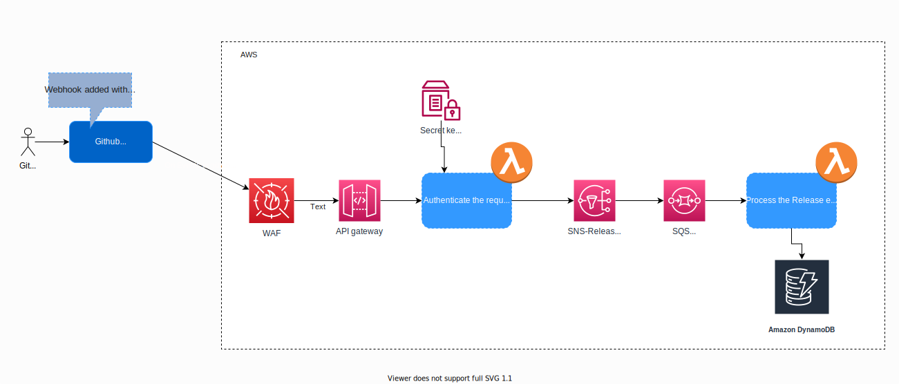

# Github-event-ingester

This repository consists of some basic code for creating an API which can be used as Github webhook to recieve events. 
Time spent on this so far - approximately 4hours

## Scenario

Record a release event from a public provider github and display them on a dashboard internally.

## Assumptions

  * Along with release events, there might be other github events that we want to capture
  * Events needs to be recieved/processed in real time
  * Recieving payload needs to be authenticated before being processed.
  * Recieving events might not just be stored, but also forwarded if required.

## Proposed Architecture (first cut :)) 

## Brief summary of the Idea
Create an POST API end point for recieving events from github. In the github, add the API end point as the webhook for the required events.
On receiving an event from Github ( POST request to API), you verify the header signature for its authenticity using the secret key that was also configured in the github. Once the payload is authenticated, its pushed to a SNS topic. It is further processed by another lambda dedicated for processing the payload and saving in DynamoDB.

## What has been done so far
  * basic folder structer for the code created
  * CDK libraries and default templates for creating CF stack
  * Code for authenticating the signature of incoming request
  * test case has been written for a method
  * Generic Publish to SNS method created
  
*Code is not production ready. Might change entirely on understanding the entire requirements*

## Things to be done
  * Write the contract of the POST API in OpenAPI, using swagger
  * Write the cloudformation code using CDK and write the test cases for the same
  * Write lot more unit tests (Would have done more of TDD in the real scenario)
  * Design the DynamoDB Table structure
  * Lambda for processing and inserting data to DB
  * Capture Decision logs (in the actual project implemenetation)

